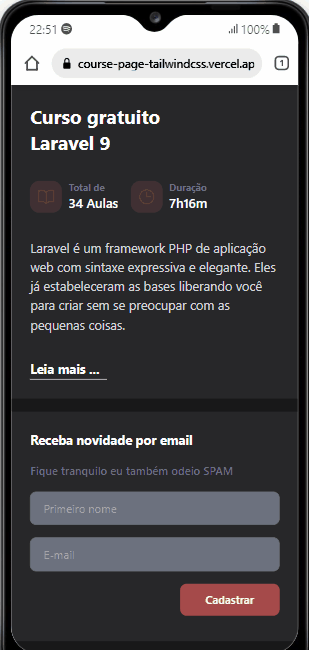

# Laravel course page


## :bookmark_tabs:Sumário

1. [Introdução](#Introduction)
2. [Demo](#live-demo)
3. [Gif ](#features-and-demo)
4. [Como rodar este projeto](#run-project)
5. [Personalizando projeto](#custom-project)


<div id="Introduction">
</br>

## :page_facing_up:Introdução
Uma landing page desenvolvida utilizando o framework tailwindcss 
```Todos os dados são estáticos```

</div>
</br>

<div id="live-demo">

Para ver o projeto rodando, clique no link abaixo.
### :camera: [LIVE DEMO](https://course-page-tailwindcss.vercel.app/) :video_camera:
</div>
</br>

<div id="features-and-demo">

## :checkered_flag: Gif's
A seguir algumas capturas do projeto em gif.

### Desktop
<p>Projeto rodando em uma tela de Desktop</p>

<br/><br/>

### Mobile
<p>Projeto rodando em um celular</p>

<br/><br/>

<div id="run-project">
</br>

## :running: Rodar projeto
Selecione o arquivo ````index.html```` e execute em um browser/plataforma de sua preferência.
</div>
</br>

<div id="custom-project">

## :customs: Personalizando projeto
Toda vez que fizer alguma mudança no ````index.html```` adicionando novas classes do tailwindcss além da classes default do projeto, execute o seguinte comando para atualizar o arquivo ````output.css````

    npx tailwindcss -i ./src/input.css -o ./build/output.css --watch
</div>
</br>

</br>
</br>

made with :heart: by Jabes Enock